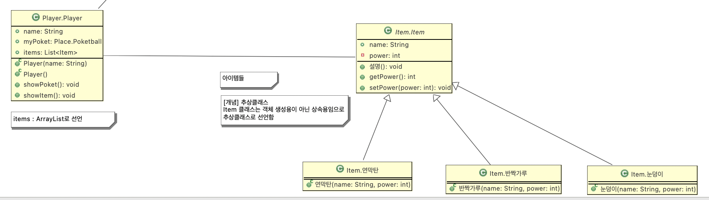
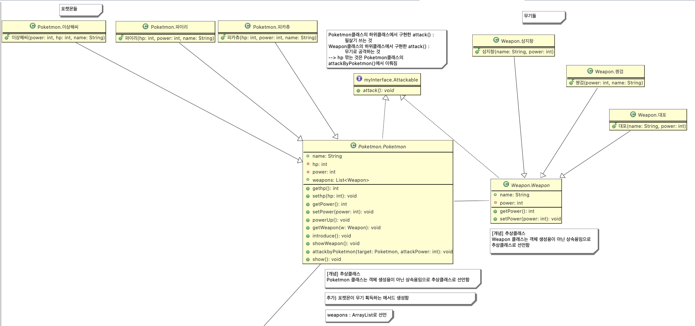
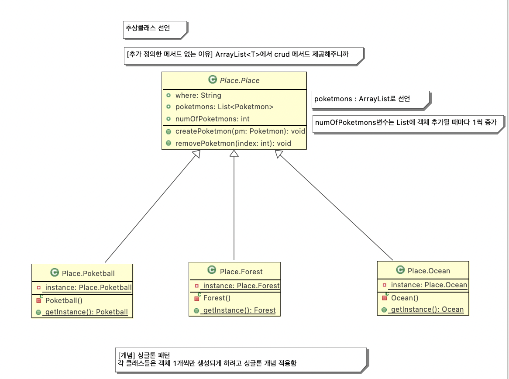

## Poketmon Game

### 프로그램의 목적

자바의 상속과 인터페이스, 추상 클래스, 자바 컬렉션의 ArrayList, 싱글톤 패턴, GUI를 하나의 프로그램에 담아 다시 한번 개념을 정리하고 활용해보기 위해 포켓몬 게임을 구현하였다.

### 개발 툴

Eclipse 

Java 11

### 클래스 다이어그램

#### Player & Item Class

#### Poketmon & Weapon Class

#### Place Class

### 동작 시나리오 및 실행화면 확인하기

https://velog.io/@fordevelop/Java-활용-포켓몬-게임 

